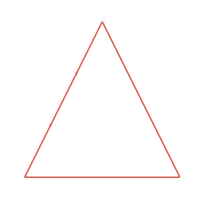

# Sierpinski triangle

The Sierpiński triangle (sometimes spelled Sierpinski), also called the Sierpiński gasket or Sierpiński sieve, is a fractal attractive fixed set with the overall shape of an equilateral triangle, subdivided recursively into smaller equilateral triangles. 

To create this fractal, shape I used the "[chaos game](https://en.wikipedia.org/wiki/Sierpi%C5%84ski_triangle#Chaos_game)" method:

1) Take three points in a plane to form a triangle.

2) Randomly select any point inside the triangle and consider that your current position.

3) Randomly select any one of the three vertex points.

4) Move half the distance from your current position to the selected vertex.

5) Plot the current position.

6)  Repeat from step 3.

The script is implemented in JavaScript. The canvas resets after 3000 iterations.

See [my personal blog](https://sites.google.com/view/emanuelemusumeci/blog/sierpi%C5%84ski-triangle) for the result.
